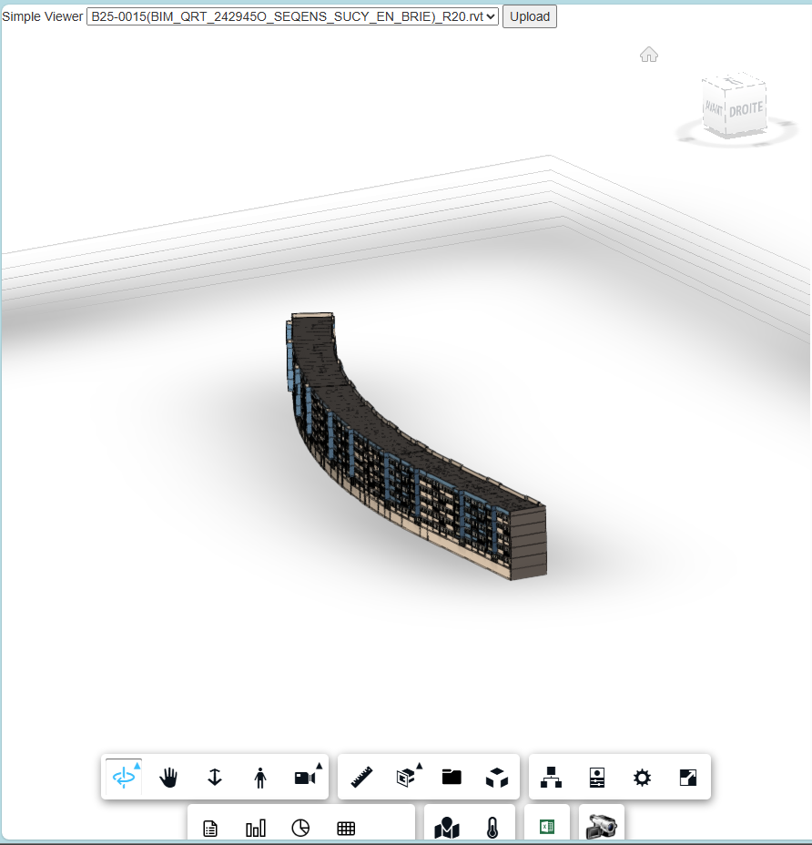

# BIM Viewer

This project is a **web-based viewer** for Building Information Modeling (BIM) data, leveraging [Autodesk Platform Services (APS)](https://aps.autodesk.com/) (formerly known as Autodesk Forge). It enables users to visualize, explore, and interact with 3D building models and associated information through a modern, responsive web interface.

---

## Table of Contents

- [Overview](#overview)
- [Features](#features)
- [Architecture](#architecture)
- [Project Structure](#project-structure)
- [Installation](#installation)
- [Configuration](#configuration)
- [Running the Application](#running-the-application)
- [Usage](#usage)
- [Contributing](#contributing)
- [License](#license)
- [Contact](#contact)

---

## Overview

The BIM Viewer provides an interactive 3D visualization of building models using Autodesk Platform Services (APS). It is designed for facility managers, engineers, and stakeholders to access real-time and historical data, analyze building performance, and support decision-making.

---

## Features

- **3D Building Visualization:** Explore BIM models in a web browser using APS Viewer.
- **APS Integration:** Securely connects to Autodesk Platform Services for model rendering and data access.
- **User Authentication:** Secure access for authorized users.
- **Custom Extensions:** Includes DataGrid, Histogram, Logger, and more.
- **External Integrations:** Google Maps and other services.
- **Responsive UI:** Works on desktop and mobile devices.
- **Data Interaction:** Query and filter building data in real time.
- **Logging and Monitoring:** Track user actions and system events.

---

## Architecture

- **Frontend:** JavaScript/TypeScript, HTML5, CSS3, [Autodesk APS Viewer](https://aps.autodesk.com/en/docs/viewer/v7/overview/).
- **Backend:** Node.js with Express.
- **Data Sources:** Real-time and historical building data via APIs.
- **Authentication:** JWT or OAuth2 (configurable).
- **APS Integration:** Uses APS APIs for model translation, authentication, and viewing.

---

## Project Structure

```
.
├── config.js
├── package.json
├── server.js
├── routes/
├── services/
├── wwwroot/
│   ├── index.html
│   ├── main.css
│   ├── main.js
│   └── extensions/
```

---

## Installation

1. **Clone the repository:**
   ```sh
   git clone <https://github.com/Ange-Morija/digital_twin.git>
   cd <project-directory>
   ```

2. **Install dependencies:**
   ```sh
   npm install
   ```

---

## Configuration

- Copy `.env.example` to `.env` and update the environment variables as needed (APS Client ID, APS Client Secret, API keys, authentication secrets, etc.).
- Ensure the port is set to `8020` if you change the default.
- Register your app on the [Autodesk Developer Portal](https://aps.autodesk.com/) to obtain APS credentials.

---

## Running the Application

Start the server with:

```sh
npm start
```

The viewer will be available at [http://localhost:8020](http://localhost:8020).

---

## Usage

- Open your browser and navigate to [http://localhost:8020](http://localhost:8020).
- Log in with your credentials.
- Use the navigation and tools to explore the 3D model and associated data.
- Models are rendered using Autodesk Platform Services (APS).

---

## Contributing

Contributions are welcome! Please fork the repository and submit a pull request. For major changes, open an issue first to discuss your ideas.

---

## License

This project is licensed under the MIT License. See the [LICENSE](LICENSE) file for details.

---

## Contact

For questions or support, please contact the project maintainer at kouamenananangemorija@gmail.com

## Example

